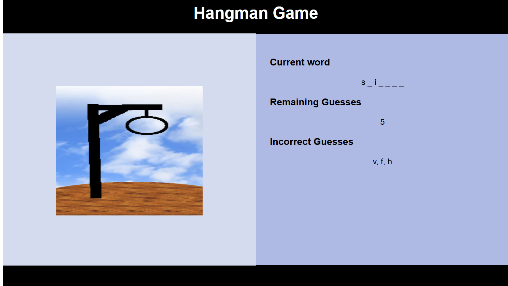

# Hangman Game
This project is developed as a part of [General Assembly](https://pshegde123.github.io/js-hangman-game/) coursework.
* This is a simple word guessing game written using `HTML,JavaSccript` and `CSS`
* Theme for this project is Marvel superhero characters, so the words generated by the computer are Marvel super hero names. (Hint: thanos,captainamerica etc.).
* A user gets ten chances to guess the letters.

# Technologies used: 
* JavaScript
* HTML
* CSS

# Getting Started
(1) Clone this repository.

(2) Change directory to js-hangman-game.

(3) In your browser, open index.html.

# Live Demo
[Click here to play](https://pshegde123.github.io/js-hangman-game/)
